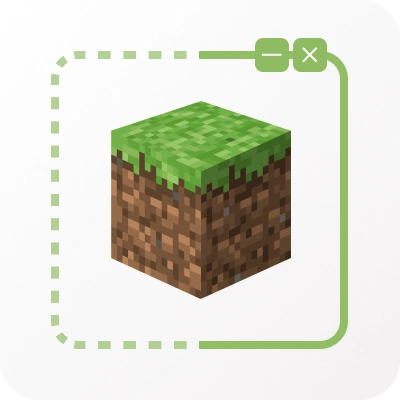
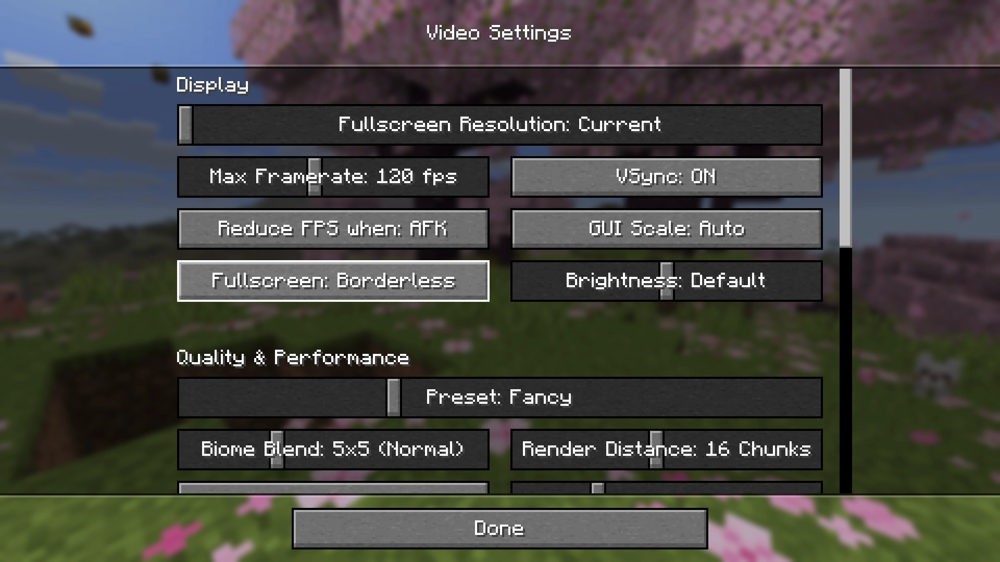
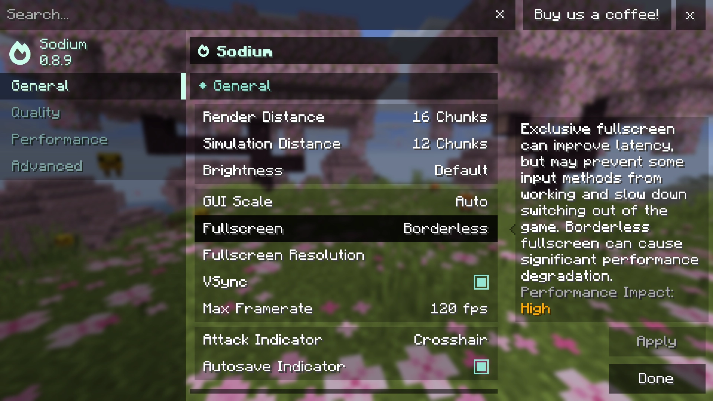
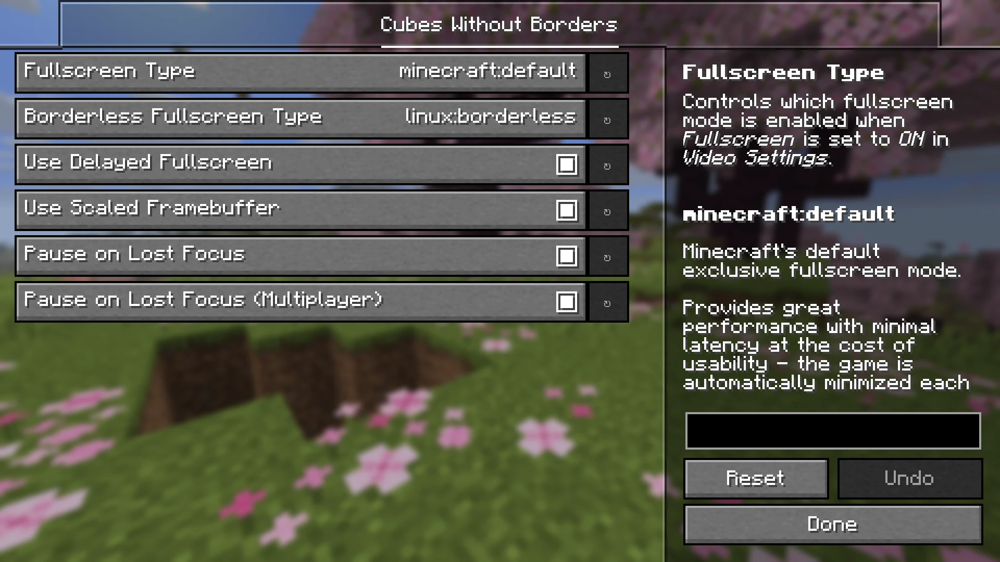

# Cubes Without Borders

[](https://github.com/Kira-NT/cubes-without-borders/actions/workflows/build.yml)
[](https://github.com/Kira-NT/cubes-without-borders/releases/latest)
[](https://modrinth.com/mod/cubes-without-borders)
[](https://www.curseforge.com/minecraft/mc-mods/cubes-without-borders)
[](LICENSE.md)



A mod that allows you to play Minecraft in a borderless fullscreen window. This means you can keep the game open while interacting with other applications on a different monitor, or even directly on top of Minecraft itself, without the game being minimized.

Unlike other "borderless fullscreen" mods, **Cubes Without Borders** is highly configurable, and it explicitly supports all major platforms - Linux, macOS, and even Windows - instead of providing a passable experience for only one group of players while making it seem as though others do not exist.

----

## Usage

To enable borderless fullscreen, go to the `Video Settings` tab, where you would typically find the `Fullscreen` setting, and switch it to the newly added third option: `Borderless`.

Depending on whether you have Sodium installed, you may find this option in one of the following locations:

|  |  |
| - | - |

Additionally, the mod introduces a `--borderless` startup flag that forces the game to launch in the borderless fullscreen mode, regardless of your current settings.

----

## FAQ

> On Windows, when I tab out of the game, its window blinks. Is there a way to disable this behavior?

This is a common issue with OpenGL applications on Windows. It has existed since Microsoft introduced the "directflip" feature in Windows 8 *(i.e., somewhere around 2012-2015)*, which forcefully changes the compositing mode for windows that occupy the entire screen, even if they opt-out of exclusive fullscreen. You can politely ask Microsoft to finally address this problem, and I'm sure they'll prioritize fixing a bug that's been plaguing their system for more than a decade over doing something really silly - which they'd never do - like shoving Copilot into Notepad.

In the meantime, you can switch the borderless fullscreen mode used by **CWB** to `windows:windowed` in the mod's settings. Be aware, however, that this *may* cause significant performance degradation, especially on more powerful systems.

<br>

> When I open Video Settings, the Fullscreen setting doesn't include a Borderless option - it's just a toggle!

You are probably using a rebranded fork of Sodium, or a version of Sodium that **CWB** doesn't support yet/already. Don't worry, though! You can access vanilla Video Settings from Sodium's custom screen by pressing <kbd>Ctrl</kbd> + <kbd>Shift</kbd> + <kbd>P</kbd> - there you'll be able to find the modified Fullscreen setting.

In fact, if you simply toggle fullscreen by pressing <kbd>F11</kbd>, for example, you should immediately jump straight into the borderless mode, as it's set as your preferred fullscreen mode by default.

<br>

> When I set Fullscreen Mode to Borderless in Video Settings, nothing really changes compared to when it is set to Exclusive - the game window continues to be automatically minimized whenever it loses focus.

**CWB** does not label its setting as "Fullscreen Mode", it is simply called "Fullscreen". It also does not require you to restart the game when switching from one fullscreen mode to another. What you are seeing is a very misleadingly named option provided by Sodium. To enable real borderless fullscreen provided by **CWB**, please see the workaround for unsupported versions of Sodium and its forks described above.

<br>

> On Linux, I want to keep a Picture-in-Picture window opened by my browser on top of the game. However, it always goes behind the game window when I switch my focus back to Minecraft.

Due to the stacking order defined by the [FreeDesktop specification](https://specifications.freedesktop.org/wm/latest/), conforming desktop environments like KDE Plasma *(rare GNOME W)* place PiP windows behind focused fullscreen applications. However, you can always change the layer assigned to the window you want to keep above your game by using window rules. Here's [an example](media/kde-plasma-window-rules.webp) of how to do this for Firefox.

----

## Config

The mod provides a simple configuration screen that can be accessed if you have [`YACL`](https://modrinth.com/mod/yacl) or [`Cloth Config`](https://modrinth.com/mod/cloth-config) installed:



Otherwise, you can configure it by directly editing the `cwb.json` file, stored in your mod loader's default configuration directory:

```jsonc
{
    // Specifies whether the game should start in windowed, exclusive fullscreen,
    // or borderless fullscreen mode.
    //
    // Should be one of: "OFF", "ON", or "BORDERLESS".
    "fullscreenMode": "OFF",

    // Specifies whether the game should enter exclusive or borderless fullscreen mode
    // when a player attempts to switch to fullscreen using a keybinding (e.g., F11).
    //
    // Should be either "ON", or "BORDERLESS".
    "preferredFullscreenMode": "BORDERLESS",

    // Specifies whether to use a full-resolution framebuffer on platforms where
    // screen coordinates can be scaled relative to pixel coordinates, such as
    // macOS and Wayland (Linux).
    //
    // Disabling this option may lead to a significant performance boost
    // at the cost of image quality.
    "useScaledFramebuffer": true,

    // When "pauseOnLostFocus" is enabled, specifies whether its effect should
    // also apply to multiplayer sessions, where the game cannot be truly paused.
    //
    // Note: "pauseOnLostFocus" is a vanilla option, and should be
    // looked for in the standard "options.txt" file.
    "pauseOnLostFocusDuringMultiplayer": true,

    // Controls which fullscreen mode is enabled when
    // "fullscreenMode" is set to "ON".
    "fullscreenType": "minecraft:default",

    // Controls which fullscreen mode is enabled when
    // "fullscreenMode" is set to "BORDERLESS".
    "borderlessFullscreenType": "minecraft:hybrid",

    // Provides configuration overrides for the Linux operating system.
    // Properties defined within this section take precedence over
    // their top-level counterparts.
    "linux": {
        "borderlessFullscreenType": "linux:borderless"
    },

    // Provides configuration overrides for the macOS operating system.
    // Properties defined within this section take precedence over
    // their top-level counterparts.
    "macos": {
        "borderlessFullscreenType": "macos:borderless"
    },

    // Provides configuration overrides for the Windows operating system.
    // Properties defined within this section take precedence over
    // their top-level counterparts.
    "windows": {
        "borderlessFullscreenType": "minecraft:windowed"
    }
}
```

### Fullscreen Types

| Name | Description |
|------|-------------|
| `minecraft:default` | Minecraft's default exclusive fullscreen mode.<br><br>Provides great performance with minimal latency at the cost of usability - the game is automatically minimized each time its window loses focus. |
| `minecraft:hybrid` | Minecraft's default non-exclusive fullscreen mode.<br><br>This is a middle ground between exclusive fullscreen and borderless fullscreen, and is mainly intended for users who don't need a true borderless experience, but want to use overlays and/or rely on IME or similar technologies. |
| `minecraft:windowed` | A windowed fullscreen mode with performance and UX characteristics that vary depending on the platform.<br><br>On **Windows**, this mode is generally the best way to play the game, as it provides the benefits typical of a borderless fullscreen experience with zero to none performance and latency penalties; however, some users may experience annoying blinking each time the game window gains or loses focus.<br><br>On **other platforms**, this mode may cause significant performance degradation and/or usability issues, such as your system's dock remaining visible or even being rendered on top of the game. |
| `linux:borderless` | The default borderless fullscreen mode for Linux.<br><br>Provides great performance with minimal latency and has no known downsides. |
| `macos:borderless` | The default borderless fullscreen mode for macOS.<br><br>Provides decent performance, but has slightly higher latency than that of the default exclusive fullscreen mode due to the implicit V-Sync imposed on all windowed applications by the OS. |
| `windows:windowed` | The true windowed fullscreen mode for Windows.<br><br>Unlike `minecraft:windowed`, it does not suffer from the blinking issues, but it also lacks the performance benefits of the said mode.<br><br>Its latency is higher than that of the default exclusive fullscreen mode due to the implicit V-Sync imposed on all windowed applications by the OS. Additionally, some users may experience severe performance degradation, as Windows sometimes discards frames provided by windowed applications instead of rendering them, especially when performing background tasks it deems more important than that, such as downloading updates or indexing screenshots of your activity captured by Windows Recall. |

----

## License

Licensed under the terms of the [MIT License](LICENSE.md).
